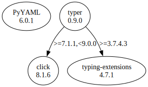

# Third Party Dependencies

<!--[[[fill sbom_sha256()]]]-->
The [SBOM in CycloneDX v1.4 JSON format](https://git.sr.ht/~sthagen/uhkamalli/blob/default/sbom.json) with SHA256 checksum ([3b981681 ...](https://git.sr.ht/~sthagen/uhkamalli/blob/default/sbom.json.sha256 "sha256:3b981681b097c740bdfb6cb9e71d5ee24d4e25f53dca554a261c8e1c1a51aa33")).
<!--[[[end]]] (checksum: c73931d658e96dd2903ba7979ea5dbdd)-->
## Licenses 

JSON files with complete license info of: [direct dependencies](direct-dependency-licenses.json) | [all dependencies](all-dependency-licenses.json)

### Direct Dependencies

<!--[[[fill direct_dependencies_table()]]]-->
| Name                                       | Version                                        | License     | Author            | Description (from packaging data)                                  |
|:-------------------------------------------|:-----------------------------------------------|:------------|:------------------|:-------------------------------------------------------------------|
| [PyYAML](https://pyyaml.org/)              | [6.0](https://pypi.org/project/PyYAML/6.0/)    | MIT License | Kirill Simonov    | YAML parser and emitter for Python                                 |
| [typer](https://github.com/tiangolo/typer) | [0.7.0](https://pypi.org/project/typer/0.7.0/) | MIT License | Sebastián Ramírez | Typer, build great CLIs. Easy to code. Based on Python type hints. |
<!--[[[end]]] (checksum: 7ea1d51e800d9cdc2f6df676ae1f50de)-->

### Indirect Dependencies

<!--[[[fill indirect_dependencies_table()]]]-->
| Name                                          | Version                                        | License     | Author         | Description (from packaging data)         |
|:----------------------------------------------|:-----------------------------------------------|:------------|:---------------|:------------------------------------------|
| [click](https://palletsprojects.com/p/click/) | [8.1.3](https://pypi.org/project/click/8.1.3/) | BSD License | Armin Ronacher | Composable command line interface toolkit |
<!--[[[end]]] (checksum: dc3a866a7aa3332404bde3da87727cb9)-->

## Dependency Tree(s)

JSON file with the complete package dependency tree info of: [the full dependency tree](package-dependency-tree.json)

### Rendered SVG

Base graphviz file in dot format: [Trees of the direct dependencies](package-dependency-tree.dot.txt)



### Console Representation

<!--[[[fill dependency_tree_console_text()]]]-->
````console
PyYAML==6.0
typer==0.7.0
  - click [required: >=7.1.1,<9.0.0, installed: 8.1.3]
````
<!--[[[end]]] (checksum: fb8a9deeb3eb15f126bd258693d0e6c0)-->
